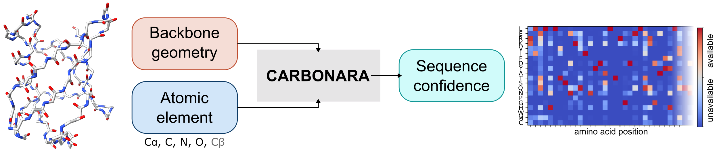

# CARBonAra: Context-aware geometric deep learning for protein sequence design


### Installing Anaconda environment

All the specific dependencies are listed in [carbonara.yml](carbonara.yml). The specific dependencies can be easily installed using [Anaconda](https://www.anaconda.com/). Create and activate the environement with:

```
conda env create -f carbonara.yml
conda activate carbonara
```


## License

This work is licensed under a
[Creative Commons Attribution-NonCommercial-ShareAlike 4.0 International License][cc-by-nc-sa].

[![CC BY-NC-SA 4.0][cc-by-nc-sa-image]][cc-by-nc-sa]

[cc-by-nc-sa]: http://creativecommons.org/licenses/by-nc-sa/4.0/
[cc-by-nc-sa-image]: https://licensebuttons.net/l/by-nc-sa/4.0/88x31.png
[cc-by-nc-sa-shield]: https://img.shields.io/badge/License-CC%20BY--NC--SA%204.0-lightgrey.svg

## Reference
