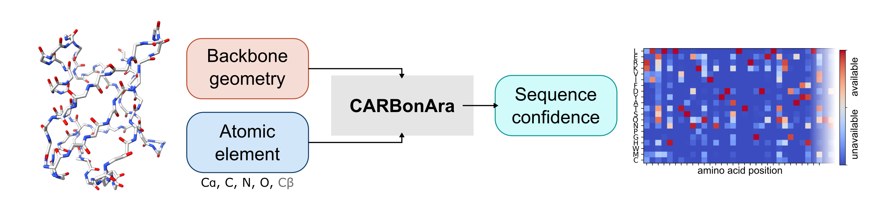

# CARBonAra: Context-aware geometric deep learning for protein sequence design

## Installation

The python package and command line tool can be installed using `pip` based on the requirements file: [requirements.txt](requirements.txt). The dependencies are linked with python version 3.9 and can be easily installed using [Anaconda](https://www.anaconda.com/). Create and activate the environment with:
```
conda create -n carbonara python=3.9
conda activate carbonara
python setup.py install
```

### Installing Anaconda environment

All the specific dependencies are listed in [carbonara.yml](carbonara.yml). The specific dependencies can be easily installed using [Anaconda](https://www.anaconda.com/). Create and activate the environment with:
```
conda env create -f carbonara.yml
conda activate carbonara
```


### Installing [ESM-IF1](https://github.com/facebookresearch/esm/tree/main/examples/inverse_folding) (optional)
```
conda create -n inverse python=3.9
conda activate inverse
conda install pytorch cudatoolkit=11.3 -c pytorch
conda install pyg -c pyg -c conda-forge
conda install pip
pip install ipykernel biotite
pip install git+https://github.com/facebookresearch/esm.git
```

## License

This work is licensed under a
[Creative Commons Attribution-NonCommercial-ShareAlike 4.0 International License][cc-by-nc-sa].

[![CC BY-NC-SA 4.0][cc-by-nc-sa-image]][cc-by-nc-sa]

[cc-by-nc-sa]: http://creativecommons.org/licenses/by-nc-sa/4.0/
[cc-by-nc-sa-image]: https://licensebuttons.net/l/by-nc-sa/4.0/88x31.png
[cc-by-nc-sa-shield]: https://img.shields.io/badge/License-CC%20BY--NC--SA%204.0-lightgrey.svg

## Reference


